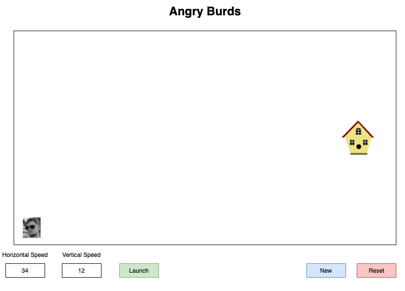
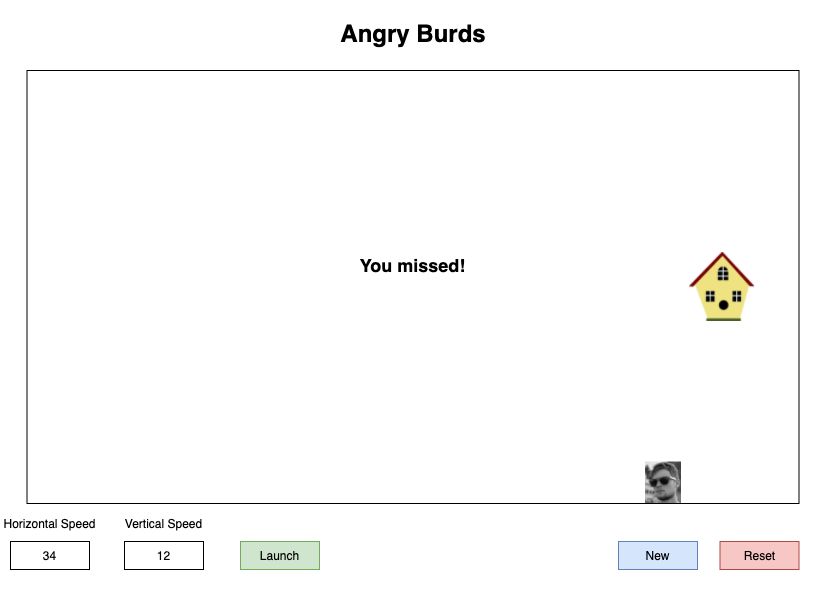
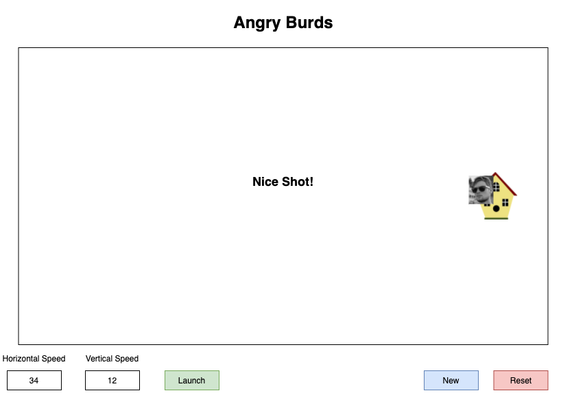

# Angry Burds

## Description
You will be building a game called Angry Burds. The goal of this game is to launch Kaleb into the bird house. The user can adjust the horizontal and vertical velocity before launching Kaleb.  

## Requirements
1. The user can view Kaleb and the bird house on the screen
1. The user can choose a horizontal and vertical speed
1. The user can watch Kaleb fly across the screen when they click the launch button. Kaleb's flight path should follow the laws of physics.
1. The user should see Kaleb stop moving and a message saying `You Missed` if Kaleb hits a wall.
1. The user should see Kaleb stop moving and a message saying `Nice Shot` if Kaleb hits the bird house.
1. The user can click `Reset` to send Kaleb back to his starting position
1. The user can click `New` to start a new game. Kaleb should be sent back to start and the bird house should be placed at a random spot on the board

### Optional
1. The user can see their score
1. The user can see a line of where kaleb flew on previous flights
1. The user can enter speed and angle rather than horizontal and vertical speeds

## Mockups  

### Starting Screen

### Missed Shot

### Bullseye

### Reset

### New

## Submission
Push to GitHub and create a pull request